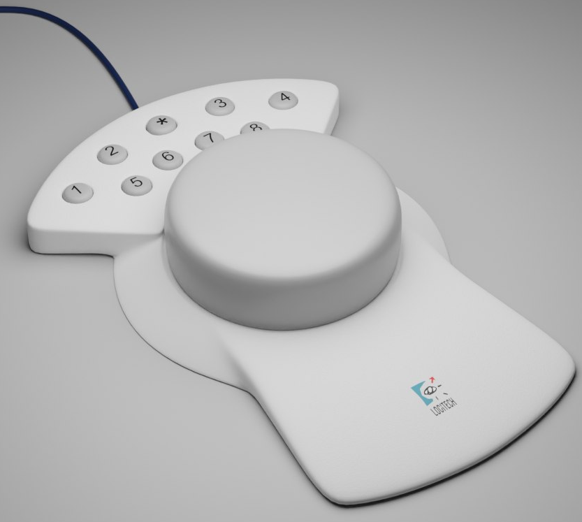

# Logitech Magellan Space Mouse USB Mod

this repo contains the code and documentation to convert a [Logitech Magellan](http://spacemice.org/index.php?title=Spacemouse_Classic) (Space Mouse Classic) to USB.

based on:
- [plopp/SpaceMouseDecoder](https://github.com/plopp/SpaceMouseDecoder) for protocol decoding base
- [AndunHH/spacemouse](https://github.com/AndunHH/spacemouse) for the HID code base
- [TeachingTech's DIY SpaceMouse](https://www.printables.com/model/864950-open-source-spacemouse-space-mushroom-remix) for the idea (code didn't work for me)

## How-To

requirements:
- a logitech magellan
- [arduino pro micro](https://www.amazon.de/EntwicklungBoards-Binghe-Mikrocontroller-Entwicklungsboard-Selbst-USB-Updater/dp/B0D69JLJ97) or other atmega32u4 based board
- [usb breakout board](https://www.amazon.de/PENGLIN-Stecker-Buchse-SMT-Typ-Steckerplatine/dp/B09FPZDDD9) (optional)
- soldering iron and some soldering skills
- a bit of patience

### 1. disassemble the space mouse

first, disassembly the space mouse.
on the bottom, below the sticker, there are 3 screws (see [image](./doc/magellan_bottom_screws.png)).
remove them carefully, then remove the bottom plate with a flat screwdriver.

unplug the serial cable and key matrix cable from the "puck" (the main board).
then, pull the puck up from the case to remove it.

remove the main board assembly from the pub by carefully levering out the pcb with a flat screwdriver.
take care to not damage the pcb or the case, and take special care not to damage the light slits attached to the top pcb.

### 2. modify the main board and interface board to output TTL serial

to attach the arduino, we need to modify the main board to output TTL serial.
additionally, two 1k resistors are added in series to the RX and TX lines to protect either side from damage.
also, on the interface board, RTS and CTS are bridged to disable hardware flow control.

for more details, refer to [schematic](./doc//Schematic_magellan-mod.pdf) and the images of the main board after the modification ([top](./doc/magellan_pcb_mod_top.png), [bottom](./doc/magellan_pcb_mod_bottom.png)).

### 3. connect the arduino

connect the arduino to the main board as follows:

- arduino GND to IF board GND
- arduino VCC to IF board VCC
- arduino RX to IF board TX
- arduino TX to IF board RX

for more details, refer to the [schematic](./doc/Schematic_magellan-mod.pdf)

### 4. upload the firmware

upload the firmware to the arduino using platformio.

### 5. calibration

to calibrate the space mouse, set `#define CALIBRATION 1` in `src/main.cpp` and upload the firmware.
then, open the serial monitor and follow the instructions.
once done, copy the output calibration values to `src/main.cpp` and re-upload the firmware with calibration disabled.

### 7. use the space mouse

to use the space mouse, install the latest [3DConnexion driver](https://3dconnexion.com/de/drivers/).
the mouse should be recognized as a 3DConnexion device and work with most 3D applications.

## Extras

the firmware supports control of a LED using the 3DConnexion software.
however, i didn't end up adding a led to my space mouse, since imo there's not enough space in the case.

if you wish to add a led, see the code in `src/main.cpp`, especially the `spaceMouse.get_led()` function.
from there, you can add a led to the hardware and control it using the 3DConnexion software.
even RGB leds should be possible, eg. when using a WS2812B.

## Troubleshooting

change the debug mode by changing `#define DEBUG 1` in `src/main.cpp` to get more information about the serial and hid communication.
from there on, good luck!
since there's so many different ways this modification could go wrong, it's hard to give a general troubleshooting guide.
If you have any questions, feel free to open an issue. I'll try to help you as best as I can.

if you have any suggestions or improvements, feel free to open a pull request.

